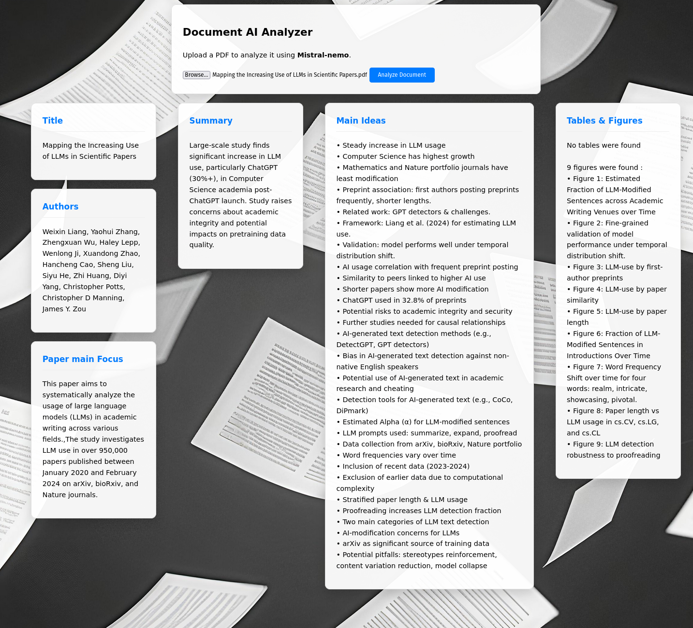

# FastAPI_paper_analysis
A small application to analyze a scientific paper using FastAPI and Ollama LLM.

## 

Several prompt engineering techniques were employed, including segmenting the paper into text chunks of 1, 2 or 3 pages.  
This approach made it possible to:
- avoid exceeding the LLM's context window;
- enhance the model's focus by preventing the dilution of attention across the entire document;
- reduce computational and token-related costs associated with large-context processing.

